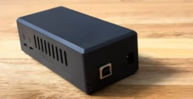

# gTenxor - SimHub Plugin

## Description

The gTenxor plugin is designed to enhance your simulation experience by controlling a seat belt/harness based on telemetry data. The plugin works by reading the telemetry data provided by the game, then it manipulates the belt tension via servos connected to the gTenxor device which interprets the data received by SimHub. This mechanism simulates the forces experienced by the player in response to in-game acceleration, deceleration, and swaying. 

The gTenxor plugin provides an adjustable maximum limit for the tension in the harness, controllable gain parameters, and filter strength for tailoring the simulated forces to the user's preferences. Moreover, it allows for testing, reversing of surge/sway forces, and includes a feature to automatically reset the servos when the game stops running.

You need the gTenxor servo control unit (pictured above) in order for this plugin to function, however this is NOT a requirement as you could use an Arduino UNO instead and connect your servo's to PWM pins 9 and 10 provided you can power your servo's externally. The sketch file is also provided and can be downloaded from the Hardware directory. The control unit (gTenxor) is an all-in-one device that is basically a plug & play solution for people that want to implement the active belt tensioning solution in the fastest and easiest way possible. If you are interested in testing the prototype (for free) let me know and I would ship one to you for free (ONLY in the continental US)

## Main Features

1. Seat belt/harness control using telemetry data.
2. Smooth servo operation using a low-pass filter.
3. Adjustable maximum tension limit.
4. Adjustable gain for Surge and Sway.
5. Option to reverse the direction of Surge and Sway.
6. Actions to toggle the belt tension on/off and increment/decrement the max tension setting.
7. Serial connection management to connect to the servo controller.

## Requirements

1. SimHub software.
2. A seat belt/harness with servo controls.
3. Appropriate serial connection setup.
4. gTenxor device (or Arduino UNO)

## Settings

The plugin has several settings available for customization, including offsets for left and right servo, max tension and filter smoothness. 

## Installation

To install the gTenxor plugin, just copy the DLL file in the directory where Simhub is installed. After successful installation, the plugin can be found in the SimHub left menu under "gTenxor Settings".

Please note that you will need to adjust the settings to match your specific setup, including the correct serial device and baud rate. For more detailed installation and setup instructions, please refer to the specific sections below.

## See it in action

You can see the actual gTenxor by watching the following YouTube video.

)

## Acknowledgments

This project makes use of portions of code (Arduino sketches) from the following contributors:

- [Arduino Blue Pill](https://github.com/blekenbleu/Arduino-Blue-Pill) by [blekenbleu](https://github.com/blekenbleu/)

## License
MIT License

Copyright (c) 2023 Jesus Altuve

Permission is hereby granted, free of charge, to any person obtaining a copy
of this software and associated documentation files (the "Software"), to deal
in the Software without restriction, including without limitation the rights
to use, copy, modify, merge, publish, distribute, sublicense, and/or sell
copies of the Software, and to permit persons to whom the Software is
furnished to do so, subject to the following conditions:

The above copyright notice and this permission notice shall be included in all
copies or substantial portions of the Software.

THE SOFTWARE IS PROVIDED "AS IS", WITHOUT WARRANTY OF ANY KIND, EXPRESS OR
IMPLIED, INCLUDING BUT NOT LIMITED TO THE WARRANTIES OF MERCHANTABILITY,
FITNESS FOR A PARTICULAR PURPOSE AND NONINFRINGEMENT. IN NO EVENT SHALL THE
AUTHORS OR COPYRIGHT HOLDERS BE LIABLE FOR ANY CLAIM, DAMAGES OR OTHER
LIABILITY, WHETHER IN AN ACTION OF CONTRACT, TORT OR OTHERWISE, ARISING FROM,
OUT OF OR IN CONNECTION WITH THE SOFTWARE OR THE USE OR OTHER DEALINGS IN THE
SOFTWARE.
